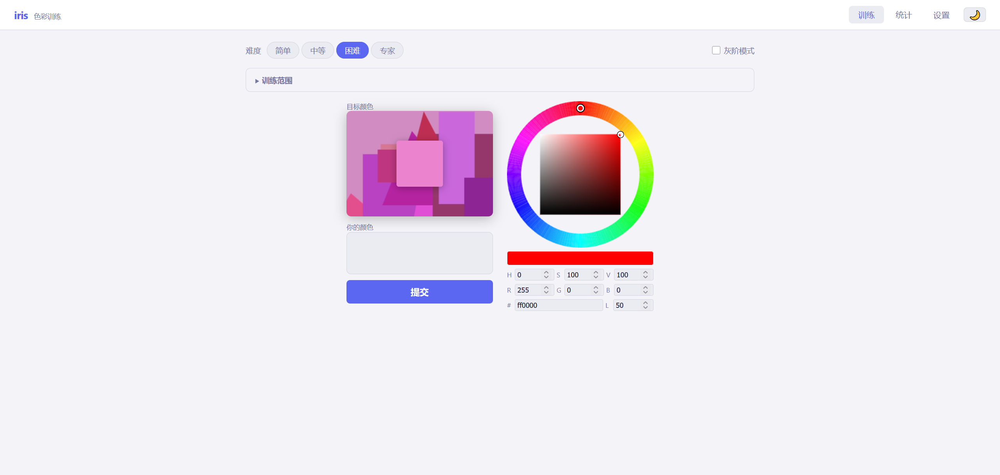
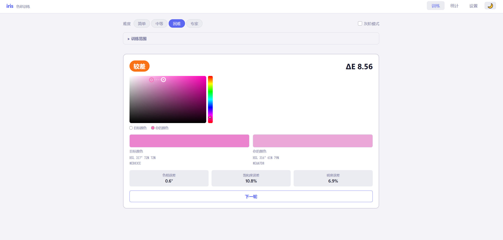

# iris — 颜色匹配训练工具

一个面向绘画学习者的纯前端颜色识别与匹配训练应用，使用工业级色差算法 CIEDE2000 评分。





---

## 功能概览

- **Photoshop 风格拾色器** — 二维饱和度/明度选区 + 色相滑条 + RGB/HSL 数值输入
- **CIEDE2000 色差评分** — 基于人眼感知的色差计算，非 RGB 欧氏距离
- **五级背景干扰** — 从纯白到类色盲测试图的渐进式干扰背景
- **灰阶训练模式** — 专项训练明度判断能力
- **训练范围配置** — 自由调节色相/饱和度/明度范围，内置多种预设
- **D3.js 统计可视化** — 色轮热力图、误差趋势图、难度雷达图
- **中英文双语** — 完整 i18n 支持，可在设置中切换
- **数据导出** — 训练记录导出为 JSON

---

## 技术栈

| 层级 | 技术 |
|------|------|
| 构建 | Vite 5 |
| 语言 | TypeScript 5 |
| 框架 | Vue 3 (Composition API) |
| 状态 | Pinia |
| 可视化 | D3.js 7 |
| 国际化 | vue-i18n 9 |
| 测试 | Vitest + @vue/test-utils |

无重量级 UI 框架，全部使用 CSS 自定义属性实现主题。

---

## 快速开始

```bash
# 安装依赖
npm install

# 启动开发服务器
npm run dev

# 构建生产版本
npm run build

# 运行测试
npm test

# 测试覆盖率报告
npm run coverage
```

---

## 项目结构

```
iris/
├── src/
│   ├── components/
│   │   ├── ColorPicker.vue        # Photoshop 风格拾色器
│   │   ├── GameBoard.vue          # 主游戏区域（目标色 + 背景）
│   │   ├── ScoreDisplay.vue       # 评分与误差详情
│   │   ├── DifficultySelector.vue # 难度选择
│   │   ├── TrainingConfig.vue     # 训练范围配置
│   │   ├── Statistics.vue         # 统计页面
│   │   ├── SettingsPanel.vue      # 设置面板
│   │   └── charts/
│   │       ├── ColorWheelHeatmap.vue       # 色轮误差热力图
│   │       ├── LightnessSaturationChart.vue # 明度-饱和度误差折线图
│   │       ├── RadarChart.vue              # 难度雷达图
│   │       └── TrendChart.vue             # 历史趋势图
│   ├── stores/
│   │   ├── gameStore.ts      # 游戏状态
│   │   ├── settingsStore.ts  # 设置与难度配置
│   │   └── statsStore.ts     # 训练记录与分析
│   ├── utils/
│   │   ├── colorMath.ts   # 色彩转换 + CIEDE2000 实现
│   │   ├── background.ts  # 背景生成算法
│   │   └── export.ts      # JSON 导出
│   └── locales/
│       ├── zh.ts
│       └── en.ts
└── tests/
    └── unit/
        ├── colorMath.test.ts   # 色彩算法 + CIEDE2000 验证
        └── statistics.test.ts  # 统计逻辑测试
```

---

## 玩法说明

1. 在顶部选择难度（简单 / 中等 / 困难 / 专家）
2. 点击 **开始训练**，屏幕上出现目标色块
3. 使用拾色器调出你认为匹配的颜色
4. 点击 **提交**，查看 ΔE 误差与评分
5. 点击 **下一轮** 继续

### 评分标准

| ΔE | 评级 |
|----|------|
| ≤ 1 | 完美 |
| ≤ 3 | 优秀 |
| ≤ 6 | 合格 |
| ≤ 10 | 较差 |
| > 10 | 失败 |

---

## 难度系统

难度由三个维度共同决定：

| 难度 | 目标色面积 | 背景干扰 | 颜色对比 |
|------|-----------|---------|---------|
| 简单 | 40% | 纯白 | 随机 |
| 中等 | 20% | 单色 | 随机 |
| 困难 | 10% | 几何块 | 相近色 |
| 专家 | 5% | 类色盲图 | 相近色 |

背景干扰共五级，可在设置中单独调节：

- **Level 1** — 纯白
- **Level 2** — 单色背景
- **Level 3** — 多色几何块
- **Level 4** — 高频噪声纹理
- **Level 5** — Ishihara 风格伪装圆点

---

## 训练范围预设

| 预设 | 说明 |
|------|------|
| 全范围 | 覆盖所有色相、饱和度、明度 |
| 低饱和度 | 训练灰调颜色识别 |
| 暗部训练 | 专注低明度区间 |
| 高饱和度 | 鲜艳色彩匹配 |
| 补色训练 | 高饱和度全色相 |

也可通过滑块自由设定色相 / 饱和度 / 明度的范围。

---

## CIEDE2000 算法

色差计算完全自行实现，位于 [`src/utils/colorMath.ts`](src/utils/colorMath.ts)。

计算流程：

```
RGB → 线性化 → XYZ (D65) → CIELAB → CIEDE2000 ΔE
```

测试用例包含 Sharma et al. (2005) 论文中的参考数据对，确保算法精度。

---

## 统计与分析

训练记录存储于 `localStorage`，统计页面提供：

- 平均 ΔE 趋势（最近 60 轮 + 移动平均线）
- 色轮热力图 — 识别哪些色相区间表现最差
- 明度/饱和度误差折线图
- 各难度表现雷达图
- 自动识别薄弱区间并推荐下一轮训练参数

数据可随时导出为 JSON 文件备份或进一步分析。

---

## 测试

```bash
npm test          # 单次运行
npm run test:watch  # 监听模式
npm run coverage    # 生成覆盖率报告
```

测试覆盖：

- 所有色彩空间转换的往返精度
- CIEDE2000 与 Sharma 2005 参考值的对比验证
- 评分逻辑与色相误差计算
- 统计存储、分析与导出逻辑
